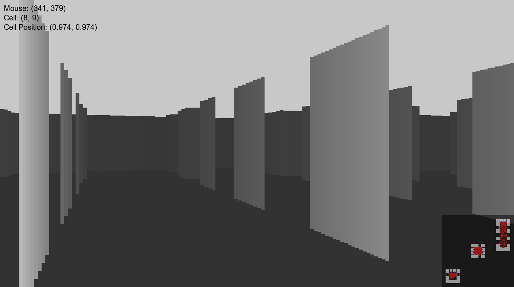
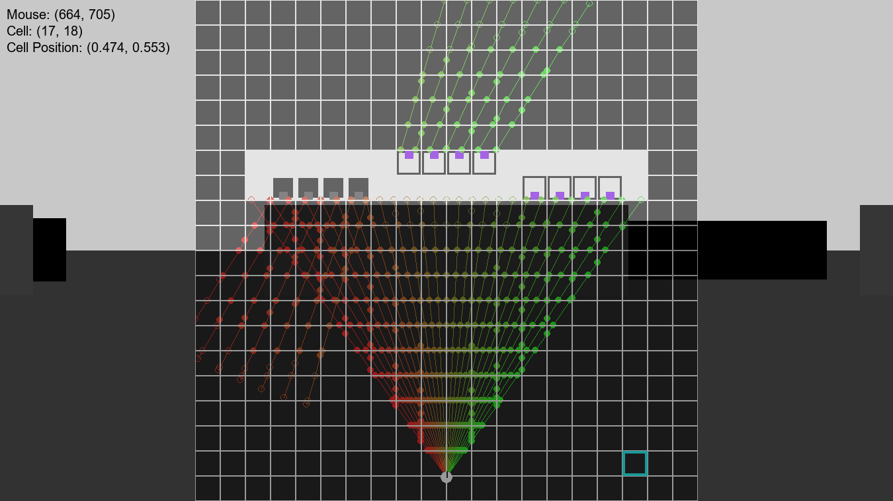

# Raycasting Sandbox
Pygame raycasting simulation with mirrors and portals.

## Features
- Configurable raycasting (FOV, ray count) and map rendering
- Switch between "play" mode and "map" mode (map visibility/editing)
- Editable map with changes reflected live
- Mirrors - reflect rays off mirror cells
- Portals - teleport rays and the player between two portal cells
## Controls
- Escape: Quit
- W/A/S/D: Move forward/left/back/right
  - Shift: Increase speed
- Left/Right Arrow: Turn left/right
- R: Flip direction/"camera"
- C: Clear the map
- Space: Switch between "play" mode and "map" mode
- In "map" mode:
  - Left Click: Place a wall
  - Right Click: Clear a cell
  - Left Shift + Left Click: Place a mirror
  - Left Ctrl + Left Click: Place a portal (with entrance on selected subsquare)
    - Place another portal on a different subsquare to link them together
## Note
- While functional, this project is still in development. Known bugs will be fixed in the future.
## Requirements
- Python 3.11 or higher
- [pygame-ce](https://pypi.org/project/pygame-ce/), [numpy](https://pypi.org/project/numpy/)
## License
- [MIT](LICENSE)